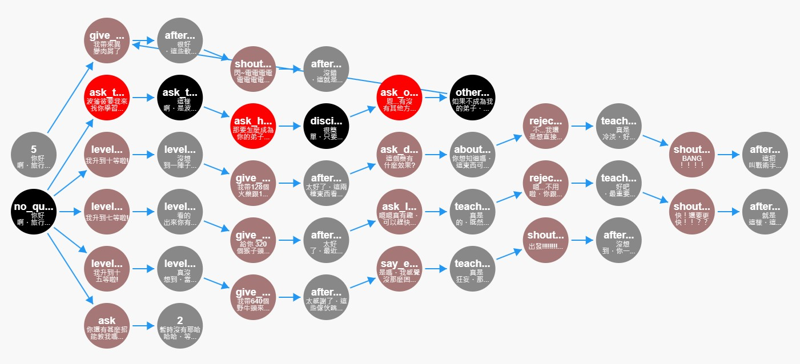

# bqDAG
A graphical interface tool designed to streamline the creation and management of conversation flow scripts for the [BetonQuest plugin](https://github.com/BetonQuest/BetonQuest). This tool provides an intuitive way to design, edit, and visualize conversation nodes and their connections.

## Features

* **Node Creation & Editing** : Create and edit nodes with text, conditions, objectives, events, and connections.
* **Conditions Control**:
Manage conditions and test node reachability or simulate different scenarios.
* **YAML Import & Export**:
Import YAML files for editing and export your work back to YAML.

## Usage
Simply download the index.html file and open it in your web browser to get started!